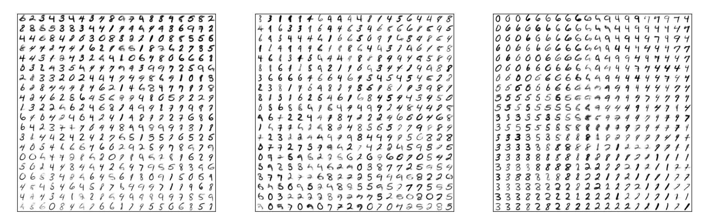
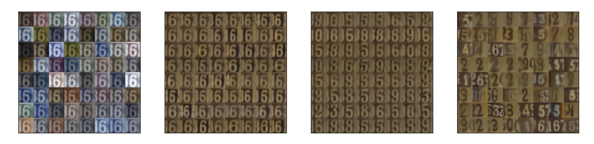
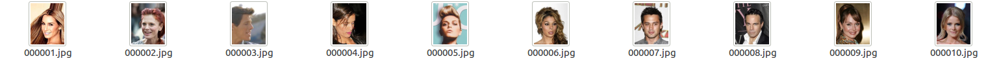
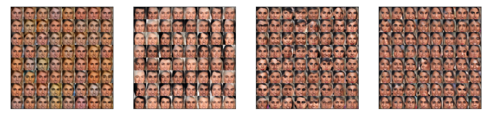

# Implementation of Variational Ladder Autoencoder


This is the implementation of the [Variational Ladder Autoencoder](https://arxiv.org/abs/1702.08396). Training on this architecture with standard VAE disentangles high and low level features without using any other prior information or inductive bias. This has been successful on MNIST, SVHN, and CelebA. 

LSUN is a little difficult for VAE with pixel-wise reconstruction loss. However with another [recently work](https://github.com/ShengjiaZhao/Sequential-VAE) we can generate sharp results on LSUN as well. This architecture serve as the baseline architecture for that model.

# Training with Default Options

## Setup

You need to have the following

- python 2 or 3 (More stable on python 2)
- tensorflow (tested on 0.12)
- numpy, scipy, matplotlib

## MNIST

You don't need to prepare the dataset for MNIST if you installed the examples that come with standard tensorflow distributions. If you can import ```tensorflow.examples.tutorials.mnist``` then simply run 

``` python main.py --dataset=mnist```

You should see results like this



Where if we sample one layer on a grid, and other layers randomly, we can see that the bottom layer represents stroke width, middle layer represents digit width, and top layer digit identity. Note that we cannot fully decouple them because digit identity is correlated with digit width (There is not really a '1' that is wide)

## SVHN

For SVHN download the dataset from http://ufldl.stanford.edu/housenumbers/

Download the three files [train_32x32.mat](http://ufldl.stanford.edu/housenumbers/train_32x32.mat), [test_32x32.mat](http://ufldl.stanford.edu/housenumbers/test_32x32.mat) , [extra_32x32.mat](http://ufldl.stanford.edu/housenumbers/extra_32x32.mat) and place them into a folder and pass the absolute path of this folder as the ```db_path``` argument. Run 

``` python main.py --dataset=svhn --db_path=/path/to/svhn/dataset ```

You should see decoupling like below



where we sample one layer randomly holding other layers fixed. The model has learned to disentangle color, digit variations, digit identity and general style.

## CelebA

For CelebA download the dataset from http://mmlab.ie.cuhk.edu.hk/projects/CelebA.html

Download the [aligned and cropped version](https://drive.google.com/open?id=0B7EVK8r0v71pbWNEUjJKdDQ3dGc), unzip into a folder, and pass the path of that folder as ```db_path``` argument. Note that your ```db_path``` folder should directly contain all the image files without any additional nesting. You folder should look like this



Now you can train by running

``` python main.py --dataset=celebA --db_path=/path/to/celebA/dataset ```

You should see decoupling like below



# Additional Options

- To use another type of regularization use ```--reg=[reg]```. Currently support ```--reg=kl``` for KL(q(z|x)||p(z)) and ```--reg=mmd``` for MMD(q(z), p(z)).
- To use a particular GPU/GPUs add option ```--gpus=[ids]``` such as ```--gpus=0,1``` to use GPU 0 and 1. In general for any of the recommended datasets the network generates good samples after running for about an hour on a single Titan X. The visualizations in the paper are produced after 1-2 days of training, but the improvement becomes marginal after the initial few hours. 
- To use other architectures other than default, use ```--netname=[name]```. For supported architectures please refer to code. The name is the unique identifier for a network configuration, and all related training log, visualizations, and checkpoint files, etc will be stored in the directory ```$pwd/model/netname```. For example, to run visualization with tensorboard use ``` tensorboard --logdir=[that directory]```.
- To also visualize the training process with a GUI window add ```--use_gui```. By default all plots will be stored to network directory, this will also plot them in a window in addition to that.
- To change batch size, add ``` --batch_size=[size]```
- To visualize and plot the autoencoding reconstruction of the model, add ```--plot_reconstruction```
- To add Gaussian and salt and pepper noise to perform denoise training add ```--denoise_train```
- To control the number of batches before we visualize and make plots, use ```--vis_frequency=[num_batch]```


